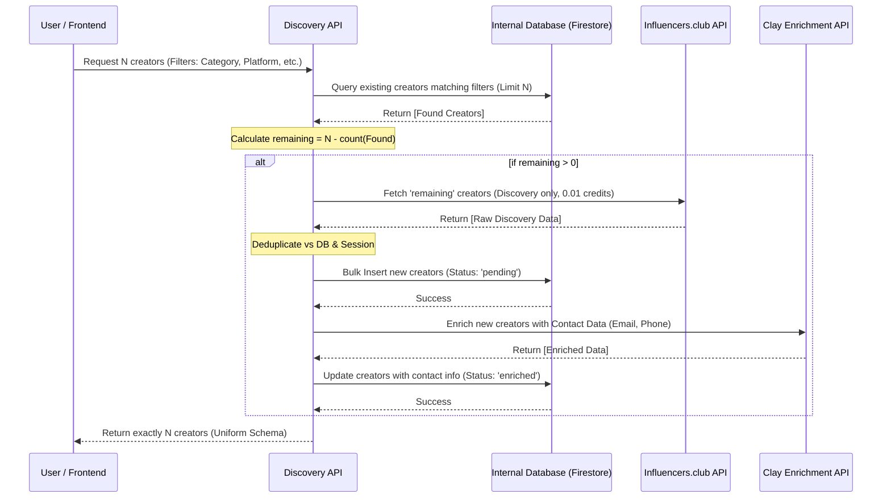

# Creator Discovery & Enrichment Pipeline

This document explains the flow of the hybrid creator discovery system.

## Sequence Diagram

## Logic Highlights

1.  **Cost Optimized**: 
    - Queries internal database first to avoid API costs.
    - Only requests discovery fields from Influencers.club (0.01 credits).
    - Only enriches unique, newly discovered creators via Clay.

2.  **Deduplication**: 
    - Prevents duplicate entries using `platform` + `handle` as a unique key.
    - Rejects duplicates before they reach the expensive Clay enrichment step.

3.  **Resilience**: 
    - If Clay enrichment fails, the system still returns the discovery data with a `failed` or `pending` status, ensuring the user gets results regardless of partial outages.

4.  **Uniformity**: 
    - Database creators and new results are mapped to the same TypeScript `Creator` model before reaching the frontend.
